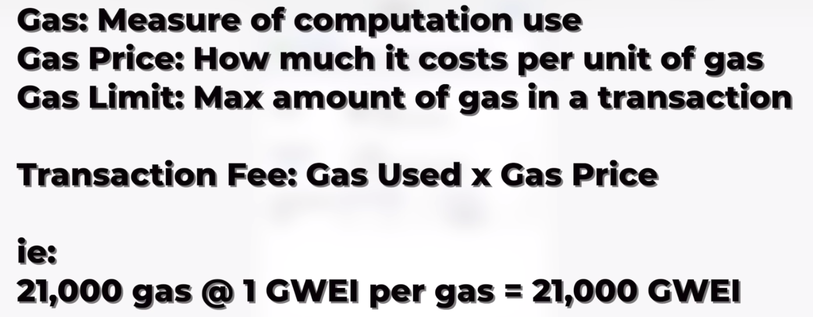
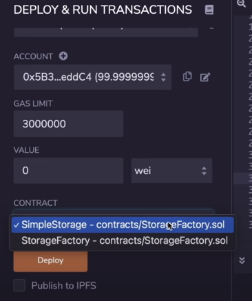

w# Solidity, Blockchain and Smart Contract Course - Beginner to Expert Python Tutorial
Link: https://www.youtube.com/watch?v=M576WGiDBdQ&t=1260s

Ethereum protocol - entirely written using smart contracts.
Bitcoin protocol - doesn't have full Touring complete application of smart contracts.

Oracle problem (Source: [link](https://blog.chain.link/what-is-the-blockchain-oracle-problem/))
- Benefit of smart contracts is they are isolated, secure, reliable. BUT this nature leads the out-of-box SC to be unable to access to external data - finanical info, market info via APIs. Therefore, **blockchain oracles** are needed to facilitate communication between blockchains and any off-chain system (data, APIs etc.)
- Oracle
  - enables smart contracts to communicate with external datasources and computation
- hybrid smart contracts
  - SCs with an offchain (external) component
  - [Chainlink](https://chain.link) - most powerful oracle network - allows for smart contract customization

Dapp = Smart Contract = Decentralized App

Ethereum is the most used blockchain SC protocol

## 00:15:04 -Features & Advantages of Smart contracts and Blockchain
1. **Decentralized** - no single entity that is controlling assets / freezing funds (GameStop)
2. **Transparency & Flexibility** - every transaction on chain can be seen. 
3. **Speed & Efficiency** - verified by decentralized entity -> faster reaction & operation time
4. **Security & Immutability** - all nodes contain same info. If one goes down, others contain it as backup
5. **Removal of counterparty risk** - BC avoids conflict of interest btw parties
6. **Trust Minimized Agreements** - unlike brand-based agreements of today. Unhappy with a bank, we switch to another bank. BC -> shift to math-based, trustless, repeatable, reliable agreements.

## 00:25:15 - Ethereum Transaction On a Live  Blockchain
### Tools, Terms etc.
- **Testnet** - test networks that act exactly like Ethereum but without real currency. E.g. Rinkeby
- **Block explorer** - views transactions that happen on a blockchain. E.g. Etherscan
- **[Etherscan](https://etherscan.io)** - see transactions on Ethereum BC
- **Gas** - every transaction costs some **gas** / paid to Blockchain miners / we get to pick how much fee we want to send / nodes can only process certain amount of transactions / why would we want to pay more gas? So that our transaction can be prioritised in the blockchain / gas price fluctuates based on demand - how many people use it

- [ETH Gas Station](https://ethgasstation.info)
- **Mnemonic (seed) phrase** - phrases generated after creating a crypto account. It should NEVER be shared with anyone.
- **Node** - Single instance in a decentralized network

## 00:43:46 -How Blockchain works/whats going on Inside the Blockchain
### Mining a Block
- Interactive Demo - [link](https://andersbrownworth.com/blockchain/)
- input Data -> SHA256 Hash -> unique Hash is generated
- Output hash has a fixed length regardless of input data size
- Input = Block & Nonce (number used once) & Data -> Output = Hash
- Valid block must have a hash with four leading zeros -> nonce is used to make block valid - aka four leading zeros in hash ([Source](https://www.javatpoint.com/blockchain-block-hashing#:~:text=The%20four%20leading%20zero%27s%20describes,it%20is%20a%20valid%20block.))

**Genesis block** - the first block in blockchain
 
Distributed Blockchain 
- has multiple peers 
- if data in one peer changes, the other peers can be used to validate what is the majority.
- the majority will be used as groundtruth and the adjusted peer will be corrected/thrown away(??)

hashing data = hashing transactions

Hashing algorithm - finds hash to data
Mining - process of finding the solution to the blockchain problem
nodes get paid for mining blocks 

block - list of transactions mined together

## 01:01:34 -Signing and Verifying a Transaction
**Public / Private Key**
Private 
- secret password to transactions / can be used to **sign** transactions / sign <-> verify 

Public
- derived from private key automatically using an algorithm / used to verify the transaction was done by you. 

## 01:09:00 -Concepts are same
Blockchains are **resilient** and **immutable**
- failed nodes are not relevant as long as there are other nodes that can be used as backup
- immutable -> they cannot be changed

**Consensus** 
- how blockchains decide what the state of the chain is
- Nakamoto consensus -> the longest chain is taken as groundtruth- 

### Terms
- **Gas fee** - paid by whoever makes the transaction
- **Proof of Work (PoW)** - BTC and ETH are PoW / uses lots of energy to find the working blocks
- **Proof of Stake (PoS)** - ETH 2.0 will be PoS sharded blockchain
- **Block reward** - paid to whoever finds a solution to BC problem. If Ethereum network, ETH is paid to solver. If BC net, Bitcoin is paid. 
- **ETH 2.0** - shift from 1 to 2 reduces environmental effects / implements **_sharding_** to solve scalability problem 
- **Sharding & Rollups** - tries to solve scalability problem / rollup examples: Arbitrom & Optimism  
- **EVM** - Ethereum Virtual Machine

## 01:29:28 - Solidity
### 01:30:47 -   [Lesson 1 - Remix IDE & its features](https://github.com/PatrickAlphaC/simple_storage)
[Remix IDE](https://remix.ethereum.org/#optimize=false&runs=200&evmVersion=null&version=soljson-v0.8.7+commit.e28d00a7.js)  
- Three folders are created as default: contracts, scripts, tests

**Tabs on Remix IDE**
- File explorer
- Solidity compiler
  - compiles all solidity code to machine understandable code
  - compiler version, language etc. can be selected
- Deploy & run transactions
  - JavaScript VM will be used as a dummy environment
  - understanding local testing is important 
- Solidity static analysis
- Solidity unit testing
- Starknet

#### Code
Include the license on the top.
`// SPDX-License-Identifier: MIT`
Defining version of Solidity on the first line.
`pragma solidity >=0.6.0 <0.9.0;`

Creating a `contract` named `SimpleStorage`. Contract is like a class. 
`contract SimpleStorage {
    
}`

**Types & Declaring Variables**
Types
- uint, int, bool, string, address
- `uint256 favoriteNumber = 5;` 
- `address favoriteAddress = ${wallet_address};`
- if not initialized by user, it will be initialized to null value (0 if int)

**Functions**
- execute modules for us
- `function store(uint256 _favoriteNumber) public {
        favoriteNumber = _favoriteNumber
    }`

**Deploying a contract**
- deploy tab on left side on Remix IDE
- **gas** - deploying a contract will cost us gas - similar to when making a transaction
- any time we want to make a **state change** on BC we have to pay gas

Being able to switch between versions of Solidity -> important skill to have.

**Visibility**
- public, external, internal (default), private
- `uint256 public favoriteNumber` will show us favoriteNumber variable under Deployed Contracts on the left side of Remix
- `uint256 favoriteNumber` will not show anything because it's not public anymore. 
- external -> can only be called by external contracts
- internal -> can only be called inside the same contract
- **default visibility**: internal
- view & pure keywords
  - view: reading a state off the BC / shown as blue button on Remix
  - pure: purely do some type of math
  - they don't change the state of the BC

**Structs**
- ways to define new types in Solidity

Example

`struct People {
        uint256 favoriteNumber;
        string name;
    }`

`People public person = People({favoriteNumber: 2, name:"Patrick"});`

**Arrays**
- storing a list of an object or type
- ??? can Solidity arrays store different types of objects? 

- `People[] public people;`
- `People[1] public people;` fixed size array
- `people.push(People(_favoriteNumber, _name));`

- memory, storage
  - memory: it will only be stored during execution, then deleted
  - storage: data will persist after function is executed

- Adding an item to the array with `push`
`function addPerson(string memory _name, uint256 _favoriteNumber) public {
        people.push(People([{favoriteNumber: _favoriteNumber, name: _name}]));
    }`

**Mapping**
- it's a data structure
- useful for getting key from value or vice versa
- `mapping(string => uint256) public nameToFavoriteNumber;` ->  Becca will be mapped to her favorite number
`function addPerson(string memory _name, uint256 _favoriteNumber) public {
        people.push(People(_favoriteNumber, _name));
        nameToFavoriteNumber[_name] = _favoriteNumber;
    }`

#### Connection to Metamask Account
- Deploy & run transactions -> environment -> select **Injected Web3** -> select Metamask account
- Injected Web3: we're taking our Metamask account and injecting into our source code in browser
- we're making a transaction on BC to create a contract
- 
### 02:09:20 -  [Lesson 2 - StorageFactory](https://github.com/PatrickAlphaC/storage_factory)

#### Importing other contracts and their functions
Sometimes it is necessary and convenient to import functionality from different contracts. 

We start by importing SimpleStorage.sol from the previous module using `import "./SimpleStorage.sol";`

This is one way of doing it. Another way is to copy and paste the `SimpleStorage` contract into `StorageFactory.sol`.

In both cases, above the **deploy** button, we have dropdown menu to select which contract we want to deploy.

Create an object of type `SimpleStorage` contract, name it `simpleStorage`, this will be a new `SimpleStorage` contract. 
`SimpleStorage simpleStorage = new SimpleStorage();`

From a contract, we can
- deploy other contracts
- call functions defined in other contracts

ABI - Application Binary Interface

#### Inheritance
StorageFactory inherits SimpleStorage 
- `contract StorageFactory is SimpleStorage { ... } `
- this way we get all functions defined in SimpleStorage in addition to what we define in StorageFactory 

### 02:26:23 -  [Lesson 3 - Fund me](https://github.com/PatrickAlphaC/fund_me)

## 03:26:35 - Python
### 03:26:35 -Lesson 4 - Web3. py SimpleStorage
### 04:27:40 -Lesson 5 - Brownie Simple Storage  

